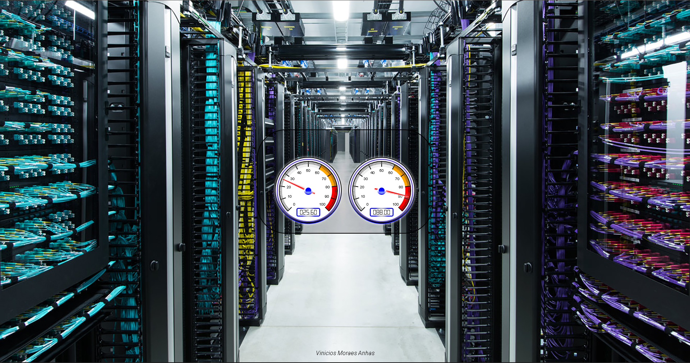

# Front-ESP8266

### Nesse projeto iremos apresentar os dados recebidos pela API-ESP8266 e apresentar em uma página web em tempo real.
___

# Sumário

* [Softwares](#Softwares)
* [Como utilizar](#Como-utilizar)
___

# Softwares

+ Visual Studio Code;
___

# Como utilizar

+ Baixe o projeto em sua máquina e em seguida abra o projeto no vscode;
+ Abra o arquivo script.js localizado na pasta js;
+ Vá ate a função <b>fetchDHT11</b>, e preencha a variável <b>url</b> com o endereço da nossa API, o mesmo endereço que utilizamos no Postman;
+ Salve o arquivo e execute o index.html;

___

 

Estou disponível para tirar qualquer dúvida do projeto 👍

   

   
